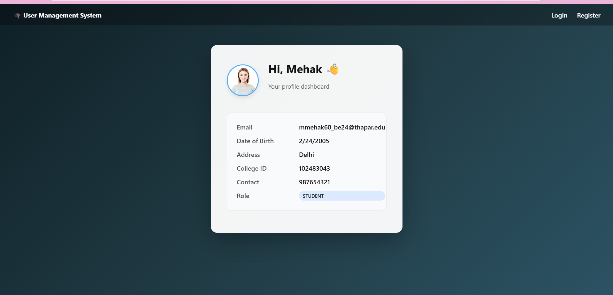
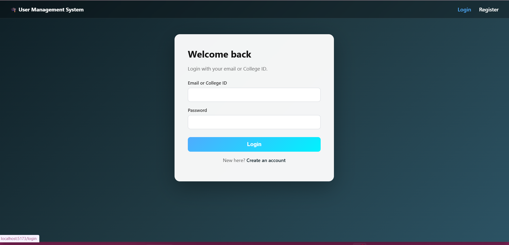
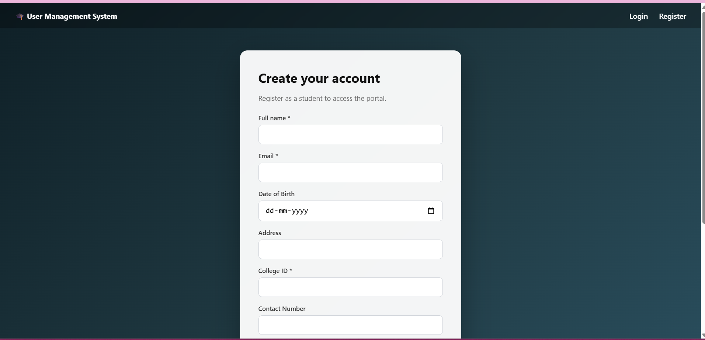
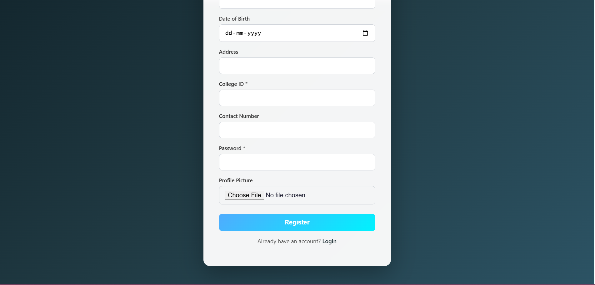
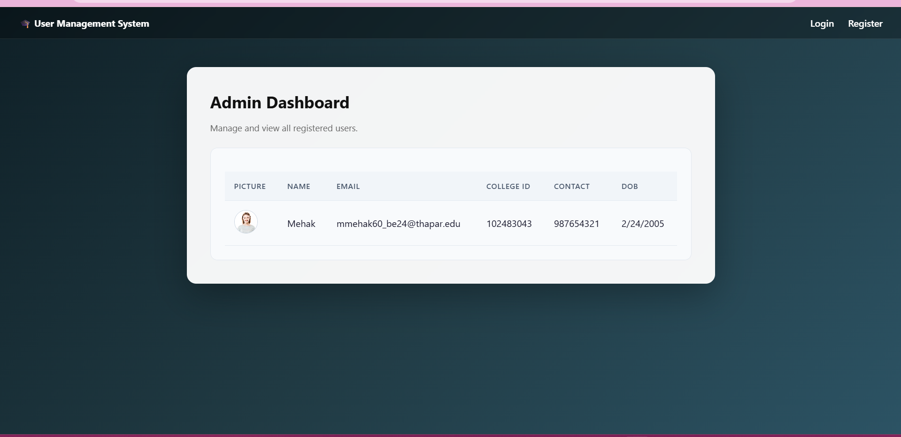
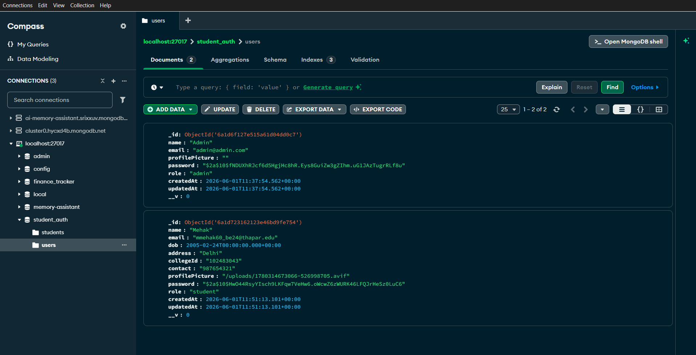

# Student Management System

A full-stack user management application with Student and Admin roles, featuring secure authentication, profile picture uploads, and a premium dynamic UI.

## Tech Stack
- **Backend:** Node.js, Express, MongoDB (Mongoose), JWT, bcryptjs, multer
- **Frontend:** React + Vite + React Router

## Key Features
- **Role-based Access:** Differentiates between Students and Admins.
- **Admin Dashboard:** Allows admins to view all registered users securely.
- **Profile Image Uploads:** Students can upload a profile picture during registration.
- **Responsive UI:** Modern glass-morphism aesthetic with CSS.

## Screenshots








## Quick Start

### Backend
```bash
cd backend
npm install
# Ensure .env has MONGO_URI and JWT_SECRET
npm run dev
```

### Frontend
```bash
cd frontend
npm install
npm run dev
```
